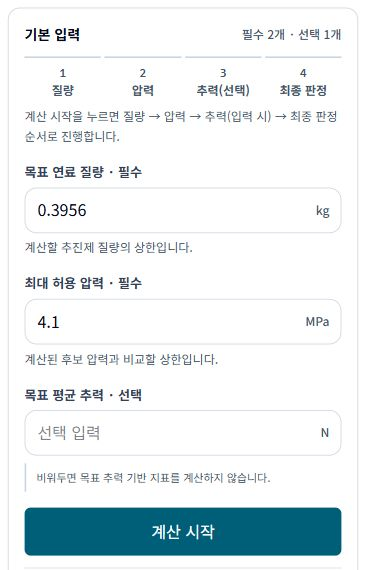
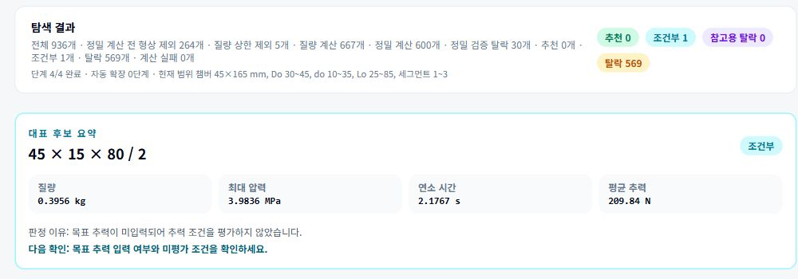
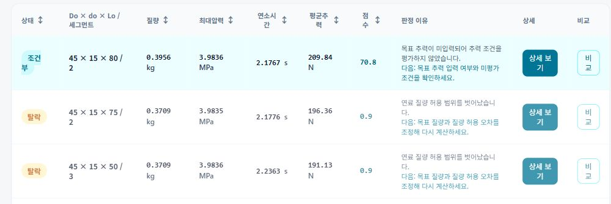
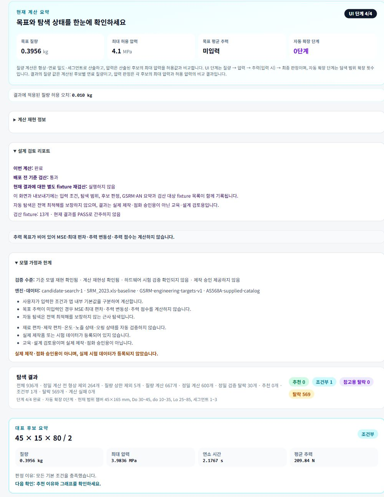

# BYPP MotorFit

MotorFit은 **목표 연료 질량과 허용 압력에 맞는 고체 로켓 모터 형상 후보를 계산하고, 결과를 비교·보관하는 교육·설계 검토용 웹앱**입니다. 기존 SRM/GSRM Excel 기반 계산에서 입력을 바꾸며 후보를 반복 비교하고 결과의 출처를 관리하는 작업을 돕기 위해 개발했습니다.

기존 계산 모델을 웹으로 옮긴 도구이며, 새로운 추진 이론을 제안하거나 실제 제작·점화를 승인하는 도구가 아닙니다. 계산 결과는 기준 모델의 예측값이며 별도의 해석·설계 검토와 실제 시험 검증을 대신하지 않습니다.

## 1. 목적과 사용 흐름

추진 설계를 학습하는 팀원과 계산 결과를 검토하는 사용자를 대상으로 합니다. 처음 사용하는 사람은 앱의 `/guide` 사용 설명서와 `기준 예시 불러오기`로 시작할 수 있습니다.

1. **입력:** 목표 연료 질량(kg), 최대 허용 압력(MPa), 선택 사항인 목표 평균 추력(N)을 입력합니다.
2. **계산:** `계산 시작`을 누르면 질량 계산 → 압력 조건 적용 → 추력 조건 적용(입력 시) → 최종 후보 판정 순서로 진행 상태를 보여줍니다.
3. **검토:** 대표 후보와 조건별 판정 이유를 확인하고, 다른 후보의 상세 결과·그래프를 보거나 최대 3개 후보를 비교합니다.
4. **관리:** 결과를 브라우저에 저장하거나 CSV/JSON·인쇄 리포트로 내보내고, 외부 측정 데이터나 what-if 시나리오와 비교합니다.

기준 예시는 **0.3956 kg / 4.1 MPa / 목표 추력 공란**, 기본 질량 허용 오차는 **0.010 kg**입니다. 예시 입력은 [공통 설정](src/app/demo-config.ts)에서 관리합니다. 최대 허용 압력은 후보의 압력 판정 조건이지 연료 질량 계산식에 직접 반영하는 값이 아닙니다.

## 2. 개발 역할과 AI 활용

이 프로젝트는 사용자의 기획·검토와 AI를 활용한 구현을 함께 진행한 프로젝트입니다. 역할을 다음과 같이 구분합니다.

| 역할 | 개발 과정에서의 작업 |
| --- | --- |
| 프로젝트 기획·검토 | 해결할 업무 정의, 요구사항 작성, 기존 기준 자료와 재현 입력 제공, 결과 검토, QA 피드백과 개선 우선순위 결정 |
| ChatGPT 활용 | 기능 범위와 사용 흐름 정리, 요구사항·설명 문구·QA 관점 검토 |
| Codex 활용 | 요구사항에 따른 코드 구현, 회귀·브라우저 테스트 작성과 실행, 발견된 문제 수정 |

기존 SRM/GSRM 계산식을 새로 창안한 프로젝트가 아니며, 모든 코드를 사람이 직접 작성했다는 의미도 아닙니다. AI가 작성한 코드 역시 기준값 재현과 테스트·결과 검토의 대상입니다. 이 역할 설명은 개발 협업 방식에 대한 설명이며, 개별 파일의 작성자나 기여 비율을 뜻하지 않습니다.

## 3. 주요 기능

### 후보 계산과 결과 해석

- **SRM(고체 로켓 모터) 계산:** 형상·질량·연소 면적·Kn(연소 면적과 노즐 목 면적의 비), 압력·블로다운·성능·노즐 관련 결과를 계산합니다.
- **후보 탐색:** 제작 후보 모드의 5 mm 규칙과 Excel 재현 모드를 구분합니다. 자동 탐색은 범위를 확장하며 후보를 검토하는 **근사 탐색**으로, 전역 최적해를 보장하지 않습니다.
- **조건별 판정:** 질량·압력·목표 추력·연소시간 조건과 판정 이유를 분리해 표시합니다. 목표 질량 상한을 넘는 후보는 추천·조건부로 표시하지 않으며, 허용 압력을 넘는 후보는 추천으로 표시하지 않습니다.
- **후보 상세·비교:** 상태·질량·압력·평균 추력·점수로 목록을 확인하고, 상세 보기와 비교 선택을 별도로 사용합니다. 압력·추력·Kn 그래프도 확인할 수 있습니다.

| 화면 상태 | 해석 |
| --- | --- |
| 추천 | 앱의 해당 판정 조건을 충족한 후보입니다. 제작 승인이나 안전 판정은 아닙니다. |
| 조건부 | 추천과 구분해 추가 확인이 필요한 후보입니다. 미입력·미평가 조건과 판정 이유를 함께 확인해야 합니다. |
| 참고용 탈락 | 추천·조건부가 모두 없을 때, 목표 질량에 가장 가까운 탈락 후보 1개를 참고용으로 분리합니다. 탈락 집계와 중복하지 않습니다. |
| 탈락 | 앱의 조건을 충족하지 못한 후보입니다. 상세 영역에서 사유를 확인합니다. |

목표 추력이 공란이면 목표 추력 기반 MSE·최대 편차·추력 변동성·추력 점수를 계산하지 않습니다. 후보의 물리 계산 결과인 평균 추력 자체는 계속 표시합니다.

### 후속 설계 검토 자료

- **GSRM·AN 오링 검사:** SRM 챔버 내경의 GSRM 기준 B 변환과 AN 카탈로그 **241개** 판정을 제공합니다. 형번 검색·페이지 이동, 신장률·압축량·압축률·홈 충전율·백업 링 조건과 판정 이유를 확인합니다.
- **RPA(외부 추진 해석 도구) 연계:** 후보에서 확인되는 압력·질량 유량·노즐 관련 값과 출처를 입력 요약으로 제공합니다. RPA에서 별도로 필요한 값은 구분하고, 확인되지 않는 값은 `미입력`으로 남깁니다. 외부 RPA 결과는 별도 참고 기록으로 관리하며 **RPA를 직접 실행하지 않습니다.**
- **Fusion 설계 검토용 요약:** 챔버·노즐·GSRM 계산값과 외부 RPA 참고값을 구분해 보여주고, 형상·재료·공차·열·구조·체결·밀봉·스냅링 검토 항목을 제공합니다. **Fusion 파일이나 제작 도면을 자동 생성하지 않습니다.**

### 결과 관리와 검토 확장

- **결과 이력:** 이름을 붙여 최대 20개 결과를 저장하고, 불러오기·이름 변경·삭제·두 저장 결과 비교를 지원합니다.
- **백업·복원:** 전체 계산 이력을 JSON으로 백업하고, 기존 이력에 추가하거나 확인 후 교체할 수 있습니다. 외부 검증 데이터·민감도 시나리오·RPA 기록·자체 점검에는 각각의 백업 흐름이 있습니다. 이력 백업 하나가 모든 별도 기록의 통합 백업을 의미하지는 않습니다.
- **내보내기·리포트:** CSV/JSON에 입력·탐색 정보·후보·버전·검산 metadata를 포함합니다. 인쇄용 HTML 리포트에서 브라우저의 `인쇄 / PDF로 저장` 기능을 사용합니다.
- **계산 재현 정보:** 계산 시각, 입력·허용 오차·탐색 범위, 후보 집계와 완료·취소·실패 상태, 앱·엔진·SRM·GSRM·AN 버전을 기록해 나중에 결과의 조건과 출처를 확인할 수 있습니다.
- **외부 검증 데이터:** 사용자가 보유한 측정값의 출처·단위·조건을 별도로 기록하고 예측값과 단건·누적 비교합니다. 허용 오차는 사용자가 입력한 경우에만 범위 내·외를 표시합니다.
- **민감도 비교:** 사용자가 지정한 질량·압력·추력·Do/do/Lo 범위·세그먼트 수의 what-if 시나리오를 기존 엔진으로 독립 실행합니다. 기준 결과를 덮어쓰지 않고 저장·백업·리포트에 활용합니다.
- **앱 자체 점검:** 기준 fixture, 결정성·경계·단위·schema 항목을 실행하고 PASS/FAIL/SKIPPED와 버전·기준 변경 정보를 확인합니다. 자체 점검 PASS는 하드웨어 검증이 아닙니다.

## 4. 실제 앱 화면

로컬 production 앱에서 기준 예시 **0.3956 kg / 4.1 MPa / 목표 추력 공란**을 직접 실행해 캡처했습니다. 수치와 판정은 화면 그대로이며, 공개 데모의 접속 상태를 의미하지 않습니다.

### 기본 입력

목표 질량·허용 압력과 선택 입력인 목표 추력을 확인한 뒤 `계산 시작`으로 진행합니다.



### 계산 결과

기준 예시의 대표 후보는 **45×15×80/2, 조건부**입니다. 질량·압력 조건에는 실패 사유가 없지만, 목표 추력이 공란이므로 추력 조건을 평가하지 않아 조건부로 표시됩니다. 자동 탐색에서 연소시간 조건은 판정에서 제외되며, 이를 조건 통과로 해석하지 않습니다.

대표 후보 요약과 목록을 나누어 핵심 수치와 판정 이유를 읽기 쉽게 제시합니다.



후보 목록의 핵심 3행입니다. 조건부 후보의 미평가 사유와 탈락 후보의 실패 사유를 구분하며, 상세 보기와 비교 선택은 별도 기능입니다.



### 설계 검토 리포트

입력·결과와 함께 계산 완료, 기준 검산, 별도 fixture 재검산 여부를 구분합니다. 모델 가정과 하드웨어 검증·제작 승인에 관한 한계도 함께 표시합니다.



## 5. 기술 구성

사용 기술과 버전은 [package.json](package.json), 설치 대상은 [pnpm-lock.yaml](pnpm-lock.yaml)을 기준으로 합니다.

| 기술 | 역할 |
| --- | --- |
| Next.js 16 · React 19 | App Router 기반 메인 계산 화면과 `/guide` 사용 설명서, 입력·결과 UI |
| TypeScript | 계산 엔진, 후보·판정·metadata·외부 데이터 구조 정의 |
| Tailwind CSS 4 | 반응형 레이아웃, 수치·상태 표시와 포커스 스타일 |
| Web Worker | 후보 탐색과 자체 점검을 UI 스레드 밖에서 실행하고 메시지로 진행률·결과를 전달 |
| localStorage · 브라우저 파일 API | 현재 브라우저에 입력·검토 기록 저장, JSON 백업·복원과 파일 다운로드 |
| Vitest | Excel 기준값 재현, 엔진 회귀·판정·단위·경계값 테스트 |
| Playwright | Chromium 기반 사용자 흐름, 실제 다운로드 파일·인쇄용 DOM·모바일·취소 성능 검증 |
| ESLint · TypeScript 검사 | 정적 코드 검사와 타입 검증 |

계산 중 화면 응답성을 유지하기 위해 Worker가 작업을 나눠 실행하고 진행 메시지를 보냅니다. UI는 취소 상태를 관리하고 Worker 중단 후 재계산을 지원합니다. 데이터 흐름은 [Worker](src/engine/search-worker.ts)와 [메인 화면](src/app/page.tsx)에서 확인할 수 있습니다.

계산 엔진은 [src/engine](src/engine), 화면은 [src/app](src/app), 자동 검증은 [tests](tests)와 [e2e](e2e)에 있습니다. 계산 결과를 보관하는 별도 서버·사용자 계정 기능은 없으며, 검토 기록은 현재 브라우저의 localStorage와 사용자가 다운로드한 파일에 보관됩니다.

## 6. 로컬 실행

Node.js와 pnpm이 필요합니다. `packageManager`는 **pnpm 11.19.0**으로 지정돼 있습니다. 문서 점검 환경은 Node.js **24.19.0**, pnpm **11.25.0**입니다. 다른 환경에서는 먼저 패키지의 엔진 요구사항과 설치 결과를 확인하세요.

저장소를 받은 뒤 프로젝트 루트에서 실행합니다.

```bash
pnpm install --frozen-lockfile
pnpm dev
```

브라우저에서 [http://localhost:3000](http://localhost:3000)을 엽니다. 사용 설명서는 [http://localhost:3000/guide](http://localhost:3000/guide)입니다.

production 빌드로 사용할 때는 개발 서버를 종료한 뒤 다음을 실행합니다.

```bash
pnpm build
pnpm start
```

기본 로컬 실행에 별도 API 키나 외부 계산 서버는 필요하지 않습니다. 설치·브라우저 바이너리 준비에는 네트워크가 필요할 수 있지만, 계산·저장·리포트는 로컬 production 환경에서 사용할 수 있습니다. 자세한 백업·복원 방법은 [로컬 사용 안내](docs/local-use.md)를 참고하세요.

## 7. 검증 방법과 해석

테스트 코드는 다음 내용을 검증하도록 구성돼 있습니다. 아래 목록은 **현재 저장소에 정의된 테스트 범위**입니다. 실제 통과 여부는 검토할 버전과 실행 환경에서 아래 명령을 실행해 확인해야 합니다.

직접 실행한 명령·테스트 개수·경고·미검증 항목은 [최신 버전 전체 검증 결과](docs/verification-results.md)에 기록했습니다. 적용 범위는 문서에 명시한 코드 커밋과 실행 환경을 기준으로 확인하세요.

- **기준 모델 재현:** 기존 SRM Excel의 질량·Kn·압력·블로다운·성능 기준값, GSRM B=49 mm·AN-132-NBR 기준과 카탈로그 241개를 대조합니다.
- **후보 회귀:** 기준 예시, 2 kg 조건부, 0.763 kg 참고용 탈락, 기존 8개 자동 추천 입력을 확인합니다. 질량·압력·목표 추력 조건의 분리도 검증합니다.
- **결정성·정밀도:** 동일 입력의 후보 순서·대표 후보·집계 재현, 표시 반올림과 원본 숫자 비교의 분리, 허용 오차 경계·잘못된 단위·비유한 수 입력을 확인합니다.
- **사용자 흐름:** 저장·복원, 후보 상세·비교, CSV/JSON 실제 다운로드 내용, 인쇄용 리포트 DOM, 외부 데이터·민감도·자체 점검, 390px 모바일 동작을 Playwright로 확인합니다.
- **성능·취소:** 넓은 탐색 범위에서 Worker 취소와 재계산, UI 응답 기준을 별도 성능 테스트로 확인합니다. 이는 특정 테스트 조건의 확인이지 모든 장치·범위의 성능 보장은 아닙니다.

정적 검사와 단위 테스트:

```bash
pnpm test
pnpm typecheck
pnpm lint
pnpm build
```

브라우저 테스트는 Chromium 바이너리를 준비하고 **최신 production 빌드**를 사용합니다. 기본 설정은 `http://127.0.0.1:3000`에서 `pnpm start` 서버를 시작하거나 기존 서버를 재사용하므로, 같은 포트의 오래된 서버를 먼저 종료하세요.

```bash
pnpm exec playwright install chromium
pnpm build
pnpm test:e2e
pnpm test:performance
```

`test:e2e`는 성능 spec을 포함한 전체 `e2e` 디렉터리를 실행하며, `test:performance`는 성능 spec만 별도로 실행합니다. 테스트 구성은 [playwright.config.ts](playwright.config.ts), 성능 조건은 [성능 검증 문서](docs/performance.md)와 [성능 spec](e2e/motorfit.performance.spec.ts)을 참고하세요.

검증 상태는 다음처럼 구분해서 해석해야 합니다.

| 구분 | 의미 |
| --- | --- |
| 자동 테스트·기준 검산 | 정해진 기준값과 소프트웨어 동작의 회귀 확인입니다. 같은 엔진의 재실행은 독립적인 물리 검증이 아닙니다. |
| 이번 계산 상태 | 완료·취소·실패를 구분합니다. 완료가 모든 후보의 조건 충족을 뜻하지는 않습니다. |
| 현재 결과 별도 fixture 재검산 | 실행 여부를 따로 표시합니다. 실행하지 않은 결과를 실시간 검산 PASS로 해석하면 안 됩니다. |
| 앱 자체 점검 | 사용자가 현재 앱의 fixture 점검을 실행한 기록입니다. 전체 자동 테스트나 실제 시험을 대신하지 않습니다. |
| 실제 하드웨어 검증 | 제작품·시험 데이터와 독립적으로 대조하는 별도 작업입니다. 기본 제공 모델 상태는 확인되지 않음이며, 제작·점화 승인을 제공하지 않습니다. |

상세 기준은 [계산 검산·버전 규칙](docs/calculation-validation.md), [단위·정밀도](docs/units-and-precision.md), [릴리스 체크리스트](docs/release-checklist.md)에 정리돼 있습니다.

## 8. 한계와 향후 확인할 항목

- 자동 탐색은 근사 탐색이며 전역 최적해를 보장하지 않습니다. 후보가 없으면 입력 조건·허용 오차·탐색 범위와 탈락 이유를 함께 확인해야 합니다.
- 기준 모델 재현과 동일 입력 재현은 실제 하드웨어의 성능·안전성을 입증하지 않습니다. 재료·제작 편차, 온도, 노즐·오링 상태를 자동 검증하지 않습니다.
- 기본 제공되는 실제 시험 데이터는 없습니다. 사용자가 외부 측정값을 기록하더라도 단일·누적 비교만으로 모델의 일반적 신뢰성이나 안전성을 판정하지 않습니다.
- RPA 해석과 Fusion 설계는 외부 도구에서 수행합니다. MotorFit의 연계 요약은 참고자료이며, 확인할 수 없는 값을 추정하거나 제작 치수를 승인하지 않습니다.
- localStorage는 브라우저 프로필·접속 주소에 종속됩니다. 데이터 삭제·저장 공간 정리로 기록이 사라질 수 있으므로 필요한 기록을 정기적으로 JSON 백업해야 합니다.
- 원본 Excel 파일은 저장소에 포함하지 않습니다. 이 README는 원본 자료나 규격 데이터의 재배포 권한·라이선스를 새로 선언하지 않습니다.

향후 개선은 실제 사용에서 입력·판정 이유를 얼마나 쉽게 이해하는지, 큰 결과의 저장·복원과 리포트가 다양한 브라우저에서 일관되는지, 출처가 확인된 외부 측정 데이터와 비교할 때 어떤 한계가 드러나는지를 확인하는 데 초점을 둡니다. 이는 향후 검토 항목이며 새 기능이나 하드웨어 검증 완료를 뜻하지 않습니다.
